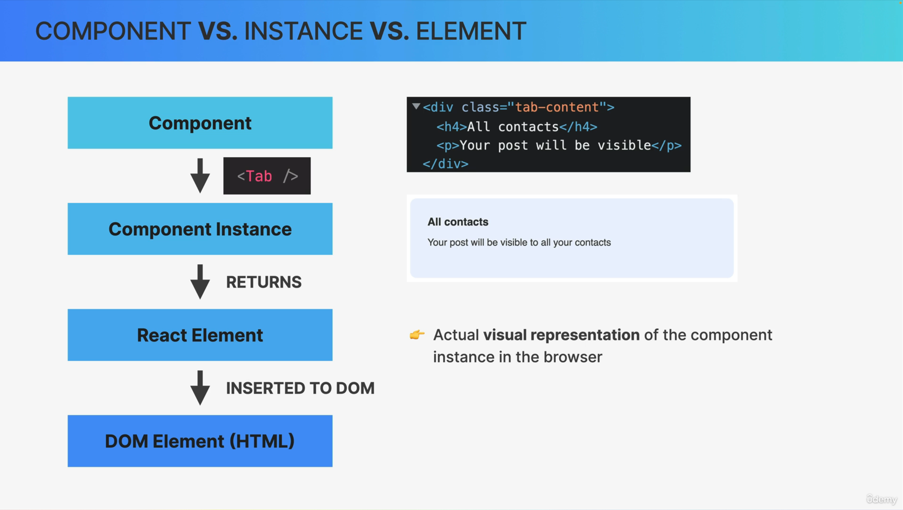
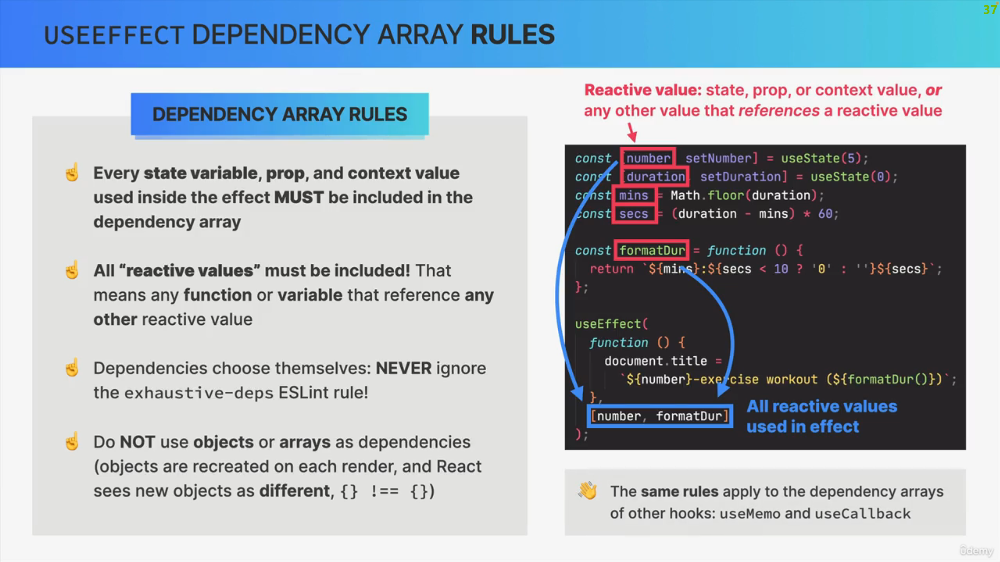

# React Notes

-   Any time you define a method that gets called in response to an event, it's good practice to name it starting with "handle"

    ```jsx
    function handleClick() {
        ...
    }

    <button onClick={handleClick}>Click Me</button>
    ```

-   One liner if statement

    ```jsx
    if (true) alert("true");
    ```

-   Logical operator short circuiting logical allows for quick if-else returns

    ```jsx
    return true || true;
    return true || false;
    // both return left-hand value

    return false || true;
    return false || false;
    // both return right-hand value

    return true && true;
    return true && false;
    // both return right-hand value

    return false && true;
    return false && false;
    // both return left-hand value
    ```

-   Logical operator short circuiting also works with more than 2 operands

    ```jsx
    return true || true || true;
    // returns left-hand value
    return false || true || true;
    // return middle value
    return false || false || true;
    // return right-hand value

    return true && true && true;
    // return right-hand value
    ```

-   Conditional rendering using && operator short circuiting

    ```jsx
    passwordCorrect = true;
    return (
        <div>
            {passwordCorrect && (
                <h1>Login Successful<h1>
            )}
        </div>
    )
    ```

-   Conditional rendering using || operator short circuiting

    ```jsx
    passwordCorrect = false;
    return (
        <div>
            {passwordCorrect || (
                <h1>Login Failed<h1>
            )}
        </div>
    )
    ```

-   React fragments allow you to wrap elements up in a "bundle" but, when the browser renders, the wrap does not get rendered and everything in it gets rendered separately. Whereas using a div tag to wrap up the elements will render the div

    ```jsx
    return (
        <div>
            <h1>Hello</h1>
            <h1>Goodbye</h1>
        </div>
    );

    /* renders
    
    <div>
        <h1>Hello</h1>
        <h1>Goodbye</h1>
    </div>
    
    */
    ```

    ```jsx
    return (
        <> // can also use <React.Fragment>
            <h1>Hello</h1>
            <h1>Goodbye</h1>
        </>
    );

    /* renders

    <h1>Hello</h1>
    <h1>Goodbye</h1>

    */
    ```

-   If you want to update state based on the current value of the state, it's best practice to pass in a callback function with the state value as the argument and perform the logic within the callback function

    ```jsx
    // Old Way
    const [step, setStep] = useState(0);

    function handleNextStep() {
        setStep(step + 1);
    }
    ```

    ```jsx
    // Best Practice Way
    const [step, setStep] = useState(0);

    function handleNextStep() {
        setStep((s) => s + 1);
    }
    ```

-   Callback functions when setting state also prevents stale state problems (when you update a state and try to access it right after, but React has not finished processing the update, so you essentially access the old state)

    ```jsx
    // Instead of this
    const [step, setStep] = useState(0);

    setStep(5);
    setStep(step + 1); // step is now 1
    ```

    ```jsx
    // Do this
    const [step, setStep] = useState(0);

    setStep(5);
    setStep((s) => s + 1); // step is now 6
    ```

-   With forms, it's better to use **onSubmit** on the form rather than **onClick** on the button. It also allows submission upon pressing the ENTER key

    ```jsx
    // Instead of this
    <form>
        <button onClick={handleSubmit}>Submit</button>
    </form>
    ```

    ```jsx
    // Do this
    <form onSubmit={handleSubmit}>
        <button>Submit</button>
    </form>
    ```

-   A controlled element within a form consists of the value, state, and onChange method so that, when a form value is manipulated, it changes the state and re-renders the component. Example:

    ```jsx
    const [name, setName] = useState("")

    <form>
        <input
            type="text"
            value={name}
            onChange={(e) => setName(e.target.value)}
        />
    </form>
    ```

-   State vs. Props

    

-   When and where to use state

    

-   You should not be mutating state directly. So, if you want to append data to an array state variable, you should do so by creating a new array.

    ```jsx
    // Instead of this
    const [items, setItems] = useState([]);

    function handleAddItems(item) {
        items.push(item);
        setItems(items);
    }
    ```

    ```jsx
    // Do this
    const [items, setItems] = useState([]);

    function handleAddItems(item) {
        setItems((items) => [...items, item]);
    }
    ```

-   When passing handler function as a prop to child component, use this naming convention

    ```jsx
    function Parent() {
        const [item, setItems] = useState([]);

        function handleAddItem() {...}

        return <Child onAddItem={handleAddItem}>
    }
    ```

-   To modify an object's property in one line, unpack the object and set the property value

    ```jsx
    const person = { name: "Bob", age: 18 };

    return { ...person, age: 30 };
    ```

-   Derived state is essentially a non-state variable who's value get's set based on a state variable. When the state variable is updated, it re-renders the component, and therefore re-calculates/re-sets the derived state variable

    

-   The children prop consists of the child elements of a component (basically whetever is embedded within the component) and every component automatically comes with this "children" prop (reserved keyword).

    ```jsx
    function App() {
        const btnOneName = "button1";
        const btnTwoName = "button2";

        return (
            <>
                // btnOneName is the child of Button component
                <Button>{btnOneName}</Button>
                <Button>{btnTwoName}</Button>
            </>
        );
    }

    function Button({ children }) {
        return <button>{children}</button>;
    }
    ```

-   Udemy React course useful resources - https://www.udemy.com/course/the-ultimate-react-course/learn/lecture/37352468#overview

-   When to create new component

    

-   Component categories

    

-   Component composition: combining different components using the **children** prop (or explicitly definining props). With component composition, we can:

    1.  Create highly reusable and flexible components
    2.  Prevent prop drilling (passing props down multiple levels of child components)

    

-   Example of fixing prop drilling with component composition (I think this is right??)

    ```jsx
    // Prop drilling
    function Parent() {
        const [name, setName] = useState("");

        return <Child name={name} />;
    }

    function Child({ name }) {
        return <Message name={name} />;
    }

    function Message({ name }) {
        return <p>My name is {name}</p>;
    }
    ```

    ```jsx
    // Component composition
    function Parent() {
        const [name, setName] = useState("");

        return (
            <Child>
                <Message name={name} />
            </Child>
        );
    }

    function Child({ children }) {
        return { children };
    }

    function Message({ name }) {
        return <p>My name is {name}</p>;
    }
    ```

-   Explicit props are essentially elements passed in as props. But, use component composition with children props instead of explicit props when you can. Example:

    ```jsx
    function Parent() {
        const [name, setName] = useState("");

        return <Child element={<Message name={name} />} />;
    }

    function Child({ element }) {
        return { element };
    }

    function Message({ name }) {
        return <p>My name is {name}</p>;
    }
    ```

    ```jsx
    // You can have multiple elements in one prop
    function Parent() {
        const [name, setName] = useState("");
        const [age, setAge] = useState(0);

        return (
            <Child
                element={
                    <>
                        <MessageOne name={name} />
                        <p> and </p>
                        <MessageTwo age={age} />
                    </>
                }
            />
        );
    }

    function Child({ element }) {
        return { element };
    }

    function MessageOne({ name }) {
        return <p>My name is {name}</p>;
    }

    function MessageOne({ age }) {
        return <p>My age is {age}</p>;
    }
    ```

-   When you define a style object within component file, define it outside the component so that the object doesn't keep getting regenerated every time the component updates

    ```jsx
    // Instead of this
    function MyComponent() {
        styles = {
            button: {...}
        }

        return <button style={styles.button}>...</button>
    }
    ```

    ```jsx
    // Do this
    styles = {
        button: {...}
    }

    function MyComponent() {
        return <button style={styles.button}>...</button>
    }
    ```

-   If you want a prop to have a default value, you can specify it when destructuring the props object

    ```jsx
    function MyComponent({ username = "defaultUsr", password = "defaultPasswd" }) {
        ...
    }
    ```

-   When building component for others to use (or even for your own applicaiton), props are like an API to your component

    

-   Regarding props as an API, you can allow a user to add class name to your component, giving them more controll over styling

    ```jsx
    function MyComponent({ className = "" }) {
        return <div className={className}>...</div>;
    }
    ```

-   In general, you don't want to initialize a component's state using props. However, this is only true if you want the state variable to stay in sync with the passed in prop. If you are using the prop only as seed data, then it's okay

    ```jsx
    // Appropriate time to initialize component's state using prop
    // number does not depend on pi after the initialization
    function MyComponent({ pi = 3.14 }) {
        const [number, setNumber] = useState(pi);
    }
    ```

-   If you're not using TypeScript, you can enforce prop types using the **prop-types** package

    ```jsx
    import PropTypes from "prop-types";

    MyComponent.propTypes = {
        name: PropTypes.string,
        age: PropTypes.number,
    };

    function MyComponent({ name, age }) {}
    ```

-   Component vs. instance vs. element

    
    
    
    

-   How rendering works in React

    

-   The reason we use keys with component lists is to prevent unecessary re-rendering of components

    

-   Two types of logic in react

    

-   Side effects vs. pure functions

    

-   Rules for render logic

    

-   React internals practical summary

    
    
    

-   The useEffect hook allows for a cleanup function that runs before the component re-renders and after it unmounts

    ```jsx
    function MyComponent() {
        useEffect(() => {
            return () => {
                console.log("Cleanup");
            };
        }, []);
    }
    ```

-   Canceling a fetch request before component re-renders / after mount

    ```jsx
    useEffect(() => {
        const controller = new AbortController();
        const signal = controller.signal;

        fetch("http://test.com", { signal: signal })
        .then((response) => ...);

        return () => {
            // cancel the request before component unmounts
            controller.abort();
        };
    }, []);
    ```

-   Event handlers are always the preffered way of creating side effects, so whenever possible, try not to overuse the useEffect hook

-   Converting a useEffect callback function to an async function (the useEffect function itself cannot be async)

    ```jsx
    useEffect(function() {
        fetch("http://test.com")
        .then((data) => console.log(data));
        .catch((err) => console.log(err));
    }, []);
    ```

    ```jsx
    useEffect(function () {
        async function getData() {
            const res = await fetch("http://test.com");
            const data = await res.json();

            if (!res.ok) console.log("Error");
            else console.log(data);
        }
        getData();
    }, []);
    ```

-   When simply updating state based on a button click, it's cleaner to wrap the state change in a handler function

    ```jsx
    // Instead of this
    function MyComponent() {
        const [clicked, setClicked] = useState(false);

        return <button onClick={() => handleClick(true)}>Click Me</button>;
    }
    ```

    ```jsx
    // Do this
    function MyComponent() {
        const [clicked, setClicked] = useState(false);

        function handleClick() {
            setClicked(true);
        }

        return <button onClick={handleClick}>Click Me</button>;
    }
    ```

-   Destructuring an object

    ```jsx
    const object = {
        _Name_: "Bob",
        _Age_: 26,
    };

    const { _Name_: name, _Age_: age } = object;

    console.log(name); // output: Bob
    ```

-   You can have multiple effects within a single component. Each effect should do **only one thing**. Use **one useEffect hook for each side effect**

    ```jsx
    function MyComponent() {
        const [thing, setThing] = useState("");

        // These two effects run only on mount
        useEffect(() => {...}, []);
        useEffect(() => {...}, []);

        // This effect runs on mount and whenever the state of "thing" updates
        useEffect(() => {...}, [thing]);
    }
    ```

-   Never call a function within the useState hook. If you need to do so, pass in a callback function and do it in there (otherwise, if done the wrong way, React will keep calling the function upon every re-render)

    ```jsx
    // Instead of this
    const [item, setItem] = useState(localStorage.getItem("item"));
    ```

    ```jsx
    // Do this
    const [item, setItem] = useState(() => localStorage.getItem("item"));
    ```

-   Overview of Ref (useRef)

    
    

-   Example of useRef for DOM selection...let's say you want to auto-focus the cursor in an input box when the component renders

    ```jsx
    function MyComponent() {
        // declare inputEl as a reference
        const inputEl = useRef(null);

        useEffect(() => {
            // call the focus method on which ever DOM element that inputEl is referencing
            inputEl.current.focus();
        }, []);

        // attach the inputEl reference to the input element
        return <input ref={inputEl} />;
    }
    ```

-   Using useRef to create variable that persists between renders

    ```jsx
    function MyComponent() {
        const [item, setItem] = useState("");
        const numberOfUpdatesToItem = useRef(0);

        // every time the item state updates, numberOfUpdatesToItem increments and that value is persistent as the component re-renders upon ever change to item
        useEffect(() => {
            numberOfUpdatesToItem.current++;
        }, [item]);
    }
    ```

-   Overview of custom hooks

    

-   Example of creating a custom hook

    ```jsx
    // No custom hook
    function MyComponent() {
        const [data, setData] = useState();

        useEffect(() => {
            fetch("http://test.com").then((data) => setDate(data));
        }, []);
    }
    ```

    ```jsx
    // Using custom hook to create re-usable code that contains hook(s)
    function useData(url) {
        const [data, setData] = useState();

        useEffect(() => {
            fetch(url).then((data) => setDate(data));
        }, []);

        return data;
    }

    function MyComponent1() {
        const data = useData("http://test1.com");
    }

    function MyComponent2() {
        const data = useData("http://test2.com");
    }
    ```

-   Another example of creating a custom hook

    ```jsx
    function useItem(initialItem) {
        const [item, setItem] = useState(initialItem);

        useEffect(() => {...}, [...]);

        return [item, setItem];
    }

    function MyComponent() {
        const [myItem, setMyItem] = useItem("");
    }
    ```

-   Overview of state management with useReducer

    

-   When to use useReducer

    

-   Code example with useReducer

    ```jsx
    const initialState = { count: 0, step: 1 };

    function reducer(state, action) {
        switch (action.type) {
            case "dec":
                // destructuring state obj and modifying count value
                return { ...state, count: state.count - state.step };
            case "inc":
                return { ...state, count: state.count + state.step };
            case "setCount":
                return { ...state, count: action.payload };
            case "setStep":
                return { ...state, step: action.payload };
            case "reset":
                return initialState;
            default:
                throw new Error("Unknown action");
        }
    }

    function CounterComponent() {
        const [state, dispatch] = useReducer(reducer, initialState);
        const { count, step } = state;

        // decrease the count
        const dec = function () {
            dispatch({ type: "dec" });
        };

        // increase the count
        const inc = function () {
            dispatch({ type: "inc" });
        };

        // set the count (using input field)
        const defineCount = function (e) {
            dispatch({ type: "setCount", payload: Number(e.target.value) });
        };

        // define steps for increasing/decreasing count
        const defineStep = function (e) {
            dispatch({ type: "setStep", payload: Number(e.target.value) });
        };

        // reset state variables
        const reset = function () {
            dispatch({ type: "reset" });
        };

        return (...);
    }
    ```

-   When creating a new React project, instead of create-react-app, use vite --> `npm create vite@latest`

-   Overview of single-page application

    

-   When building your React app with routes, you essentially have pages (the larger structural components) and components that make up those pages. Define your pages in one directory and the components that make up those pages in another directory

    ```
    |--/src
        |--/components
            ...
        |--/pages
            |--Homepage.jsx
            |--Pricing.jsx
            |--Product.jsx
    ```

    ```jsx
    function App() {
        return (
            <BrowserRouter>
                <Routes>
                    <Route path="/" element={<Homepage />} />
                    <Route path="pricing" element={<Pricing />} />
                    <Route path="product" element={<Product />} />
                </Routes>
            </BrowserRouter>
        );
    }
    ```

-   When routing, to handle a user request for a page that doesn't exist, create a route with a wildcard path as the last route defined

    ```jsx
    function App() {
        return (
            <BrowserRouter>
                <Routes>
                    <Route path="/" element={<Homepage />} />
                    <Route path="pricing" element={<Pricing />} />
                    <Route path="product" element={<Product />} />
                    <Route path="*" element={<PageNotFound />} />
                </Routes>
            </BrowserRouter>
        );
    }
    ```

-   Navigating to a different page

    ```jsx
    import { Link } from "react-router-dom";

    function Homepage() {
        return <Link to="/pricing">Pricing</Link>;
    }
    ```

-   Styling options in React

    

-   Using CSS modules (**allows for local scoping of CSS**)

    ```
    |--/src
        |--/components
            |--MyComponent.jsx
            |--MyComponent.module.css
    ```

    ```css
    /* MyComponent.module.jsx */
    .mycomponent h2 {
        ...;
    }

    .mycomponent button {
        ...;
    }

    .bigBtn {
        ...;
    }
    ```

    ```jsx
    // MyComponent.jsx
    import styles from "./MyComponent.module.css";

    function MyComponent() {
        return (
            <div className={styles.mycomponent}>
                <h2>...</h2>

                <button className={styles.bigBtn}>...</button>
                <button>...</button>
            </div>
        );
    }
    ```

-   Never select HTML elements within CSS modules, as this will have global effect (verify this!). If you want to select an HTML element, preceed it with a parent class selector

    ```css
    /* Instead of this */
    h2 {
        ...;
    }
    ```

    ```css
    /* Do this */
    .mycomponent h2 {
        ...;
    }
    ```

-   Giving CSS global scope within CSS module

    ```css
    /* Inside CSS module file */
    :global(.test) {
        ...;
    }
    ```

-   Nested routes

    ```jsx
    function App() {
        return (
            <BrowserRouter>
                <Routes>
                    <Route path="/" element={<Homepage />} />
                    <Route path="parent" element={<Parent />}>
                        <Route path="child1" element={<Child1 />} />
                        <Route path="child2" element={<Child2 />} />
                        <Route index element={<Child3 />} /> // default route
                    </Route>
                </Routes>
            </BrowserRouter>
        );
    }
    ```

    ```jsx
    import { Outlet } from "react-router-dom";

    function Parent() {
        return (
            ...
            // if user browses to /parent/child1, then Child1 component is rendered in place of Outlet
            // if user browses to /parent/child2, then Child2 component is rendered in place of Outlet
            // if user browses to /parent, then Child3 component is rendered in place of Outlet
            <Outlet />
            ...
        );
    }
    ```

-   Url for state management

    

-   Including and using URL params

    ```jsx
    function App() {
        return (
            <BrowserRouter>
                <Routes>
                    <Route path="component1" element={<Component1 />} />
                    <Route path="component2/:id" element={<Component2 />} />
                </Routes>
            </BrowserRouter>
        );
    }
    ```

    ```jsx
    function Component1() {
        const id = ...;

        // if you just provide id, then it will append id to the current url
        // but if you include a /, then it will treat the string as a whole url
        return <Link to={`${id}`}>...</Link>;
    }
    ```

    ```jsx
    function Component2() {
        const { id } = useParams();

        return <h1>This is the id: {id}</h1>;
    }
    ```

-   The useNavigate hook

    ```jsx
    function MyComponent() {
        const navigate = useNavigate();

        return (
            ...
            // go to CURRENT_URL/page
            navigate("page");
            ...
            // go to previous page
            navigate(-1);
            ...
        )
    }
    ```

-   Overview of context API

    

-   Context API usage example

    ```jsx
    import { createContext, useState, useContext } from "react";

    // Step 1) Create a context
    const ItemContext = createContext();

    function App() {
        const [item1, setItem1] = useState(...);
        const [item2, setItem2] = useState(...);

        function handleSetItem2() {
            ...
            setItem2(...);
        }

        return (
            // Step 2) Provide value to child components
            <ItemContext.Provider value={{
                i1: item1,
                i2: item2,
                onSetItem2: handleSetItem2,
            }}>
                // components embedded within provider get access to context
                <MyComponent />
            </ItemContext.Provider>
        )
    }

    function MyComponent() {
        // Step 3) Consume context value
        const { item2, onSetItem2 } = useContext(ItemContext);

        return (...)
    }
    ```

-   Cleaner way of implementing context API is to pull the context logic out and place into a component

    ```jsx
    // ItemContext.js
    import { createContext, useState, useContext } from "react";

    const ItemContext = createContext();

    function ItemProvider({ children }) {
        const [item1, setItem1] = useState(...);
        const [item2, setItem2] = useState(...);

        function handleSetItem2() {
            ...
            setItem2(...);
        }

        return (
            <ItemContext.Provider value={{
                i1: item1,
                i2: item2,
                onSetItem2: handleSetItem2,
            }}>
                // now any children components get access to the context
                {children}
            </ItemContext.Provider>
        )
    }

    // create custom hook so we don't have to keep writing "useContext(ItemContext)"
    function useItems() {
        const context = useContext(ItemContext);
        // error handling to make sure we are using useItems in the right places
        if (context === undefined)
            throw new Error("ItemContext was used outside the ItemProvider")
        return context;
    }

    export { ItemProvider, useItems };
    ```

    ```jsx
    import { ItemProvider, useItems } from "./ItemContext";

    function App() {
        return (
            <ItemProvider>
                <MyComponent />
            </ItemProvider>
        );
    }

    function MyComponent() {
        const { item2, onSetItem2 } = useItems();

        return (...)
    }
    ```

-   State placement options overview

    

-   State management tool options

    

-   It is a common state management system to set up a context API along with useReducer

    ```jsx
    import {
        createContext,
        useContext,
        useReducer,
    } from "react";

    const ItemsContext = createContext();

    const initialState = {
        item1: "",
        item2: "",
    };

    function reducer(state, action) {
        switch (action.type) {
            case "action1":
                return {...};

            case "action2":
                return {...};

            default:
                throw new Error("Unknown action type");
        }
    }

    function ItemsProvider({ children }) {
        const [{ item1, item2 }, dispatch] = useReducer(reducer, initialState);

        async function doSomething() {
            dispatch({ type: "action1" });
            ...
            dispatch({ type: "action2", payload: ... });
            ...
        }

        return (
            <ItemsContext.Provider
                value={{
                    item1,
                    item2,
                    doSomething,
                }}
            >
                {children}
            </ItemsContext.Provider>
        );
    }

    function useItem() {
        const context = useContext(ItemsContext);
        if (context === undefined)
            throw new Error(
                "ItemsContext was used outside the ItemsProvider"
            );
        return context;
    }

    export { ItemsProvider, useItems };
    ```

-   Optimize code by preventing useless re-render of child components. If a parent component re-renders, then its child components re-render. However, components passed in via the children prop render before the parent component renders, therefore, a re-render of the parent will not affect those children

    ```jsx
    // Unoptimized code

    function SlowComponent() {
        // this component takes a long time to render
        ...
    }

    function ParentComponent() {
        const [count, setCount] = useState();

        return (
            <div>
                // every time count increases, component re-renders and therefore SlowComponent re-renders
                <button onClick={setCount((c) => c + 1)}>
                    Increase Counter
                </button>
                <SlowComponent />
            </div>
        );
    }
    ```

    ```jsx
    // Optimized code

    function SlowComponent() {
        // this component takes a long time to render
        ...
    }

    // pass in children prop
    function Counter({ children }) {
        const [count, setCount] = useState();

        return (
            <div>
                <button onClick={setCount((c) => c + 1)}>
                    Increase Counter
                </button>

                // replace SlowComponent with children prop
                {children}
            </div>
        );
    }

    function ParentComponent() {
        const [count, setCount] = useState();

        return (
            <Counter>
                // now, SlowComponent gets rendered before Counter
                // therefore, re-render of Counter will not trigger re-render of SlowComponent
                <SlowComponent />
            </Counter>
        )
    }
    ```

-   Overview of memoization

    
    

-   Memoizing a component so that it only re-renders if props change (Important note: if an object is passed in as a prop, this technique will not work becuase two different object that are exactly the same are still considered different and therefore React sees a new prop passed in and will trigger a re-render. Solution is to use useMemo)

    ```jsx
    // Unoptimized code
    function SlowComponent({ item }) {...}
    ```

    ```jsx
    // Optimized code
    import { memo } from "react";

    const SlowComponent = memo(({ item }) => {...});
    ```

-   Overview of useMemo and useCallback

    
    

-   Memoizing an object with useMemo (takes 2 args: a callback function that returns the desired object and a dependency array to determine when to re-generate the object)

    ```jsx
    // Unoptimized code
    import { memo } from "react";

    const obj = {...};

    function MyComponent() {
        return <SlowComponent obj={obj} />;
    }

    const SlowComponent = memo(({ obj }) => {...});
    ```

    ```jsx
    // Optimized code
    import { memo, useMemo } from "react";

    const obj = useMemo(() => {
        return {...};
    }, [...]); // only use primitive types here in dependency array, no objects

    function MyComponent() {
        return <SlowComponent obj={obj} />;
    }

    const SlowComponent = memo(({ obj }) => {...});
    ```

-   Memoizing a function with useCallback

    ```jsx
    // Unoptimized code
    import { memo } from "react";

    function func() {...}

    function MyComponent() {
        return <SlowComponent func={func} />;
    }

    const SlowComponent = memo(({ func }) => {...});
    ```

    ```jsx
    // Optimized code
    import { memo, useMemo } from "react";

    const func = useCallback(function func() {...}, [...]);

    function MyComponent() {
        return <SlowComponent func={func} />;
    }

    const SlowComponent = memo(({ func }) => {...});
    ```

-   The bundle and code splitting

    
    

-   Example of code splitting (lazy loading)

    ```jsx
    // Before code splitting
    import Homepage from "...";
    import Product from "...";
    import Pricing from "...";

    function App() {
        return (
            <BrowserRouter>
                <Routes>
                    <Route index element={<Homepage />} />
                    <Route path="product" element={<Product />} />
                    <Route path="pricing" element={<Pricing />} />
                </Routes>
            </BrowserRouter>
        );
    }
    ```

    ```jsx
    // After code splitting
    import { lazy, Suspense } from "react";

    // the first time you visit home page, it will be slow because code needs to be sent from server
    const Homepage = lazy(() => import("..."));
    // the first time you visit product page, it will be slow because code needs to be sent from server
    const Product = lazy(() => import("..."));
    // ...and so on
    const Pricing = lazy(() => import("..."));

    function App() {
        return (
            <BrowserRouter>
                // when a component hasn't finished loading, show default
                <Suspense fallback={<LoadingComponent />}>
                    <Routes>
                        <Route index element={<Homepage />} />
                        <Route path="product" element={<Product />} />
                        <Route path="pricing" element={<Pricing />} />
                    </Routes>
                </Suspense>
            </BrowserRouter>
        );
    }
    ```

-   Performance optimization do's and dont's

    

-   Some more rules and suggestions regarding useEffect

    
    
    
